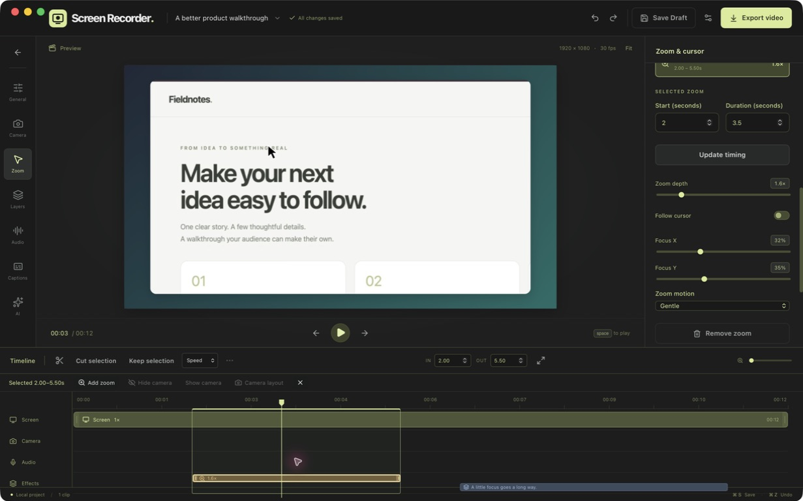

<p align="center">
  
</p>

<h1 align="center">Recora Screen</h1>

<p align="center"><strong>The open-source screen recorder you can control with Claude and Codex.</strong></p>

Record your screen, camera and audio, or start with an existing video. Select a clip to edit its properties, then export your video. Claude and Codex can also control projects, edits and exports through MCP. Built for tutorials, walkthroughs and product demos on Mac.



_Actual desktop app with clean demonstration footage._

## Download the public beta

Version 0.1.1 is available as a Developer ID signed and Apple notarized public beta for Apple silicon and macOS 15+. The app bundles Node and Whisper; end users do not need to install Node.

- [Download Recora Screen 0.1.1 for Apple silicon](https://github.com/serkan-uslu/recora-screen/releases/download/v0.1.1/Recora-Screen_0.1.1_macOS-arm64.dmg).
- [Release notes](https://github.com/serkan-uslu/recora-screen/releases/tag/v0.1.1).
- [Build and run from source](#develop).
- [Product documentation](https://recora-screen.vercel.app/documentation/).
- Product site: [recora-screen.vercel.app](https://recora-screen.vercel.app/). Locally, `npm run dev:site` serves `http://127.0.0.1:4174/`.

SHA-256 is published in the release assets.

## Connect Claude or Codex

Open the desktop app, then go to **Settings & MCP → MCP & shortcuts**. Choose your client and copy its configuration. Run Recora Screen from `/Applications` first; MCP setup blocks mounted-DMG and AppTranslocation paths because they are temporary. Paths come from the running installation, including the bundled Node runtime. The server is named `recora-screen`; remove an older `screen-recorder`, `screenRecorder` or `screen_recorder` entry before adding it.

| Client         | Setup                                            |
| -------------- | ------------------------------------------------ |
| Codex          | [TOML configuration](docs/mcp.md#codex)          |
| Claude Code    | [CLI command](docs/mcp.md#claude-code)           |
| Claude Desktop | [JSON configuration](docs/mcp.md#claude-desktop) |

Try a request such as:

> Open my tutorial. Suggest silence cuts and let me review them. Hide my camera between 10 and 20 seconds, add a title for the first 3 seconds, and export a 1080p MP4.

MCP uses the same validated project, recording, editing, preview and export commands as the app. Edits support revision checks and grouped undo. Long analysis/export operations return jobs with progress and cancellation. Keep the desktop app running while connected. [Connection checks and command contract](docs/mcp.md#verify-your-connection).

The app and local tools are free. Your connected Claude/Codex client may require its own plan; the optional in-app OpenAI/Anthropic assistant uses your API key and provider billing. No app API key is needed for ordinary MCP project, edit or export operations.

## Create, edit and keep your work

- **Capture:** screen, window or region; separate camera, microphone and system audio; pause/resume and a background recording control.
- **Start:** choose Record screen to open capture setup, Import video for an MP4/MOV/M4V, or Open project to resume a saved project folder. The editor’s first-edit guide and permanent Quick start help cover play, split/delete and export. [Getting started](docs/editor-features.md#get-started).
- **Launch:** a branded splash covers local workspace initialization, then opens the project library using the same cream and forest-green identity as the product site.
- **Edit:** live timeline scrubbing, range selection, split/delete/trim, speed, clip merging, clip reordering, removed-range restoration and undo/redo. Select a clip to open its properties; the delete action names the affected object. Filmstrips and audio waveforms help locate content, with separate Zoom and Layers rows. Insert videos or still images between clips, use Delete/Backspace for selected objects, and resize the timeline vertically. [Timeline editing guide](docs/editor-features.md#timeline-editing).
- **Direct attention:** continuous typing holds one automatic zoom; edit zoom timing/depth/motion in a dialog without losing your list position. Split camera ranges keep their own placement, appearance and visibility, and crossing zooms separate at the split. Cursor highlight, motion blur, click bounce, sway, light/dark styles and looped paths are available. [Zoom and clip settings](docs/editor-features.md#automatic-zooms-and-clip-settings).
- **Compose:** circle or square camera with mirroring, adjustable corners/shadow and zoom-reactive scaling; draggable text, images and arrows; timed blur and opaque privacy covers; backgrounds, blur, padding, rounded corners, shadows and browser frames. Landscape, portrait, square and 4:5 canvases are supported.
- **Audio and captions:** independent audio levels, imported music/voiceover clips with timing and volume controls, local Whisper transcription, editable captions and microphone-based silence suggestions that protect audible system audio by default.
- **Export:** H.264/AAC MP4 up to 4K or silent GIF (15–30 FPS, up to 1280 pixels and 60 seconds, optional looping), using the same native composition engine as preview; captions can be burned in or saved as SRT/VTT.
- **Projects:** create, search, rename, reopen, import and move project folders to the macOS Trash. Edits save automatically; Save now remains in Project options. Exported movies remain separate; original media stays intact.

For upgrade compatibility, projects remain in `~/Movies/Screen Recorder Projects/`. Each portable folder contains its document, a previous valid backup, original media and imported assets. Saves are atomic. There are no artificial project-count or recording-duration limits; disk space and hardware determine capacity. One recording runs at a time, and its project is protected while other projects remain editable.

## Local processing and current limits

Recording, editing, silence analysis and Whisper transcription run on your Mac. Models download separately; multilingual `small` is the default and `base` uses fewer resources. After download, local AI works offline. Review transcription timing and silence suggestions before applying cuts. Silence cleanup requires a microphone track.

The optional in-app cloud assistant sends your prompt, necessary transcript and edit context to your chosen provider; API keys stay in macOS Keychain. External MCP clients can request transcripts and preview frames and may send those results to their model provider. The desktop app has no analytics; optional site analytics are separate. [Privacy details](docs/privacy.md).

Screen, camera and microphone permissions depend on what you capture. Pointer sampling works without Input Monitoring; typing activity and precise short-click detection require the optional event monitor. Typed text and key codes are not recorded.

The public beta is Developer ID signed and Apple notarized. Windows, Linux and Intel distribution are outside the current Apple silicon beta target.

## Develop

Requires macOS 15+, Xcode and its command line tools, Rust, Node.js 22.12+, Git and CMake. React/TypeScript provides the UI; Node owns project operations and MCP; Tauri and the native macOS engine handle desktop/media integration.

```sh
npm ci
npm run prepare:whisper
npm run dev
```

Initial preparation downloads a checksum-verified Node runtime and builds a pinned whisper.cpp release. Models download separately from Settings and are not committed to Git.

For browser UI development, run these in separate terminals:

```sh
npm run dev:server
npm run dev:web
```

Browser development can manage real local projects. Capture and native composition preview require the desktop app.

```sh
npm test
npm run build
npm run desktop:check
npm run desktop:build
npm run test:launch
npm run check:launch -- --json
```

App bundles and DMGs are written under `src-tauri/target/release/bundle/`. `check:launch` is read-only and exits nonzero while release evidence is incomplete.

## Contribute

Read the [MCP setup guide](docs/mcp.md). The in-app **Quick start** dialog covers the creator workflow. Open an issue or contact [Serkan Uslu](https://serkanuslu.com) at [info@serkanuslu.com](mailto:info@serkanuslu.com).

## License

MIT. Dependency and model notices are in [THIRD_PARTY_NOTICES.md](THIRD_PARTY_NOTICES.md).
